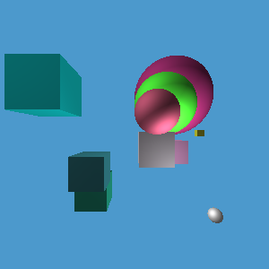
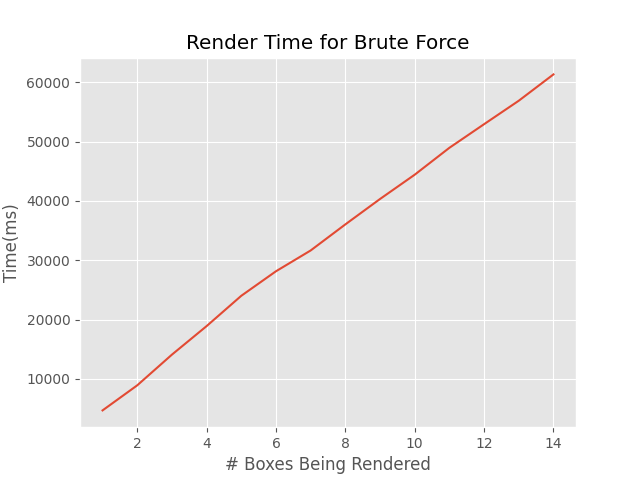
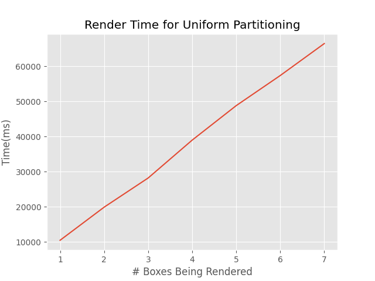
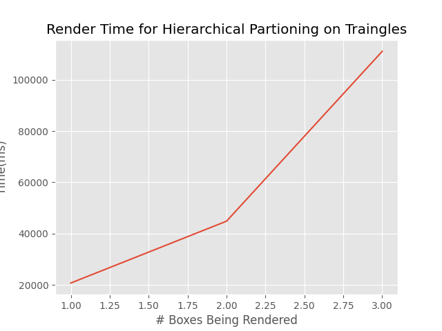
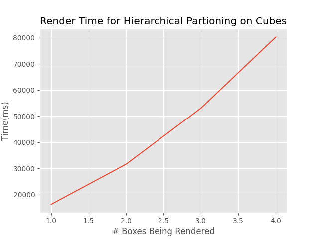

# CSCI 441 Lab9 - Spatial Data Structures
A lab exploring how to accelerate rendering time based on different spatial data structures.

# Original Brute Force Ray Tracing
Our original brute force ray tracing implementation checked every ray against every pixel to determine whether or not there was an intersection and which intersection occurred. The closest intersection with the given shape defined how the pixel was colored. This is the traditional way of ray tracing, but this method quickly breaks down when many objects and shapes are added to a scene. As seen in the graph below, this method took about 14 boxes to reach a render time of at least 60 seconds.

# Uniform Partitioning in 4 Equal Quadrants
For this method, we hard-coded our quadrants in as bounding boxes. The window was split up into 4 separate bounding boxes and for each ray, we checked to see if there was an intersection. If there was, we then checked for the first intersection and colored the pixel accordingly. This method performed better than the hierarchical partitioning around just triangles because there were significantly fewer checks to be made based on the number of bounding boxes. However, this method was wasting a lot of time checking intersections on bounding boxes for rays that did not contain any objects. As seen in the graph below, this method took about 7 boxes to reach a render time of at least 60 seconds.

# Hierarchical Partitioning Defined by Bounding Boxes Around Each Triangle
This method was the worst out of all the methods because of the amounts of bounding boxes created. For this method, we defined a bounding box for each triangle. Then, for each ray, we checked to see if it intersected with a bounding box. If it did, we checked the closest intersection and colored the pixel based on the closest object it intersected with. The render time on this method had so many bounding boxes that the number of checks is what causes it to take so long. As seen in the graph below, this method took about 2 boxes to reach a render time of at least 60 seconds.

# Hierarchical Partitioning Defined by Bounding Boxes Around Each Cube
Our implementation of hierarchical bounding boxes around each cube rather than each triangle performed better than each triangle because now our bounding boxes contained heaps of triangles rather than just one for checking. However, this method still not perform quite as good as the brute force method because we still had to add bounding boxes for each circle. To achieve better performance than the brute force method we would have to implement a tree of bounding boxes with parents representing a bounding box that has children of the two bounding boxes inside of it. This way we would minimize overlap and optimize the number of triangles in each bounding box. As seen in the graph below, this method took about 4 boxes to reach a render time of at least 60 seconds.

# Contributers
* [Ethan Miller](https://github.com/EthanMiller2)
* [Alexander Pelaez](https://github.com/AlexPelaez)

# Licence
[MIT](LICENSE)
